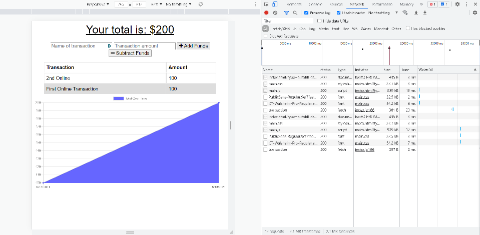
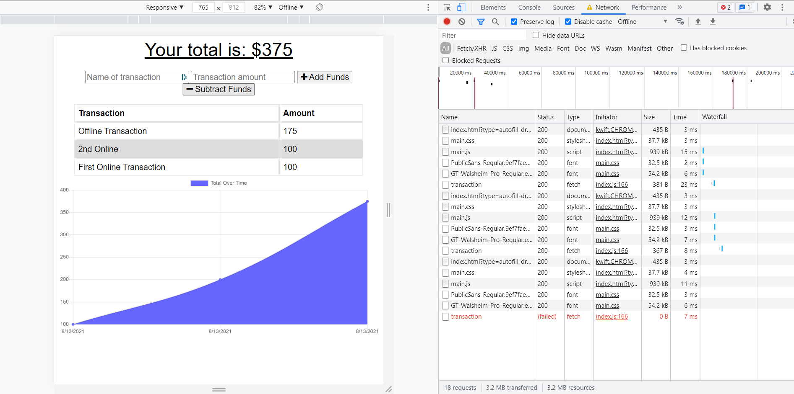
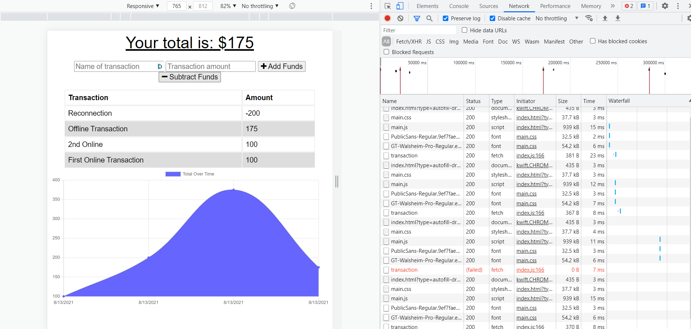

# budget-tracker

## Description
Personal expense tracker PWA using Express and MongoDB.

## Table of contents
  - [Description](#description)
  - [Table of contents](#table-of-contents)
  - [Installation](#installation)
  - [Screenshots](#screenshots)
  - [Heroku Demo](#heroku-demo)
  - [Questions](#questions)

## Installation
Navigate to main folder of the app in a terminal, then type `npm start` to begin the server. Navigate to `localhost:3000` to view the live app.

## Screenshots

### Recording Transactions While Online

### Recording Transactions While Offline

### Reconnection

## Heroku Demo

[Click here to view the project live hosted on Heroku](https://safe-journey-25534.herokuapp.com/)

## Questions
Please direct questions to:
- E-mail: wing_andrew@hotmail.com
- Github:<https://github.com/wingeh>
